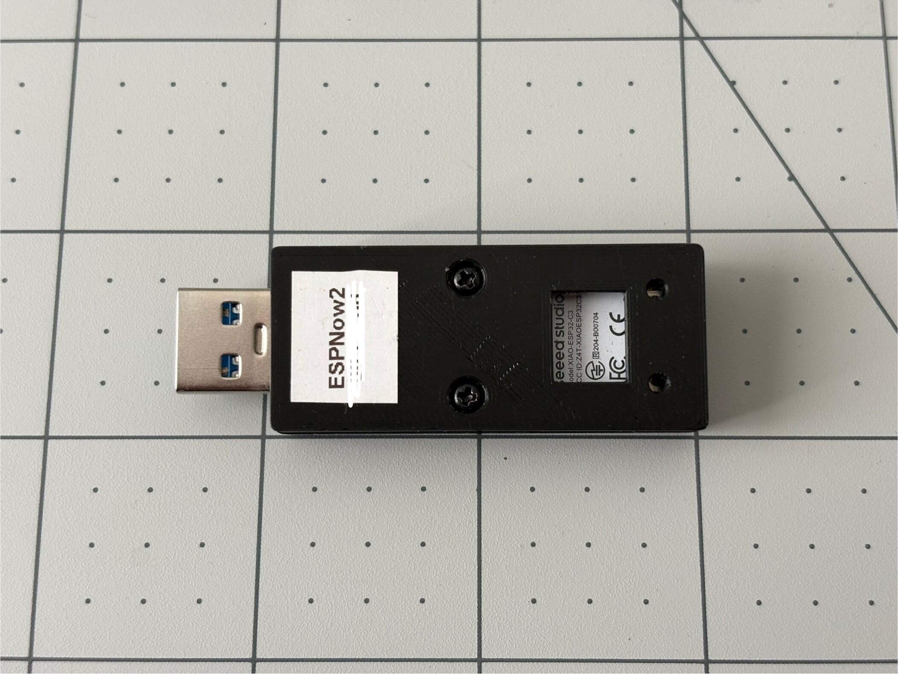
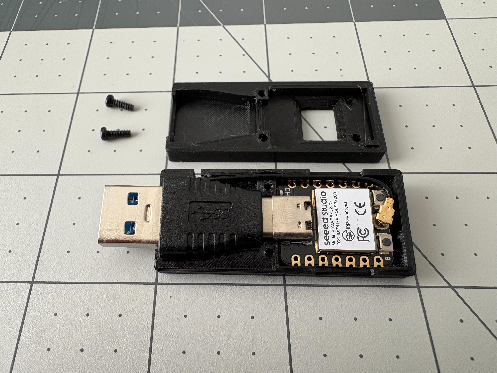

# ESPNowDongle

ESPNowDongle is a 3D-printed design that converts a Seeed Studio XIAO ESP32C3 into a USB dongle for hobby wireless projects. With this dongle, you can easily control wireless robots with your laptop utilizing the [ESPNow protocol](https://www.espressif.com/en/solutions/low-power-solutions/esp-now). This repo hosts design files, bill of materials (BOM), and building instructions, and will potentially contain example firmware in the future.

  
  

An example use case is my popular open-source project, [Q8bot](https://github.com/EricYufengWu/q8bot):

  

## Building Instruction
The design is simple and straightforward. A short bill of materials (BOM) is available [here](https://docs.google.com/spreadsheets/d/1V8coFRCDSXpK4gbwrFuEnwwwXwfb0ANbZXYGAyK8Xq8/edit?usp=sharing). 

The steps to build an ESPNowDongle can be summarized as follows:
1. Purchase required components.

2. 3D-print the shell components (2 pieces, top & bottom).

3. Install the Seeed XIAO board and USB adapter to the bottom shell.

4. Install the wired antenna that came with the Seeed XIAO purchase. Route the wire through the geometry in the bottom shell and use the build-in adhesive back to secure the antenna to the back of the bottom shell.

5. Install the top shell and secure the dongle with 2 M2 screws.

6. Plug in the dongle to a laptop/PC and start programming.
